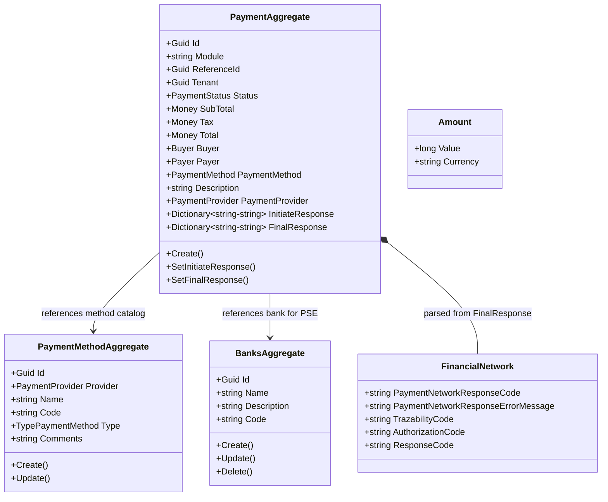
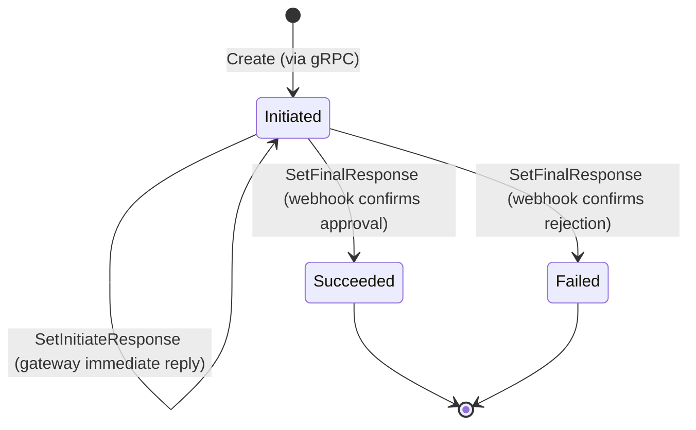
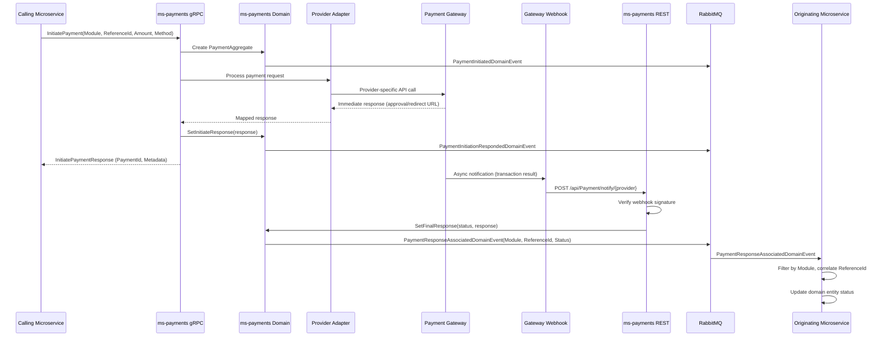
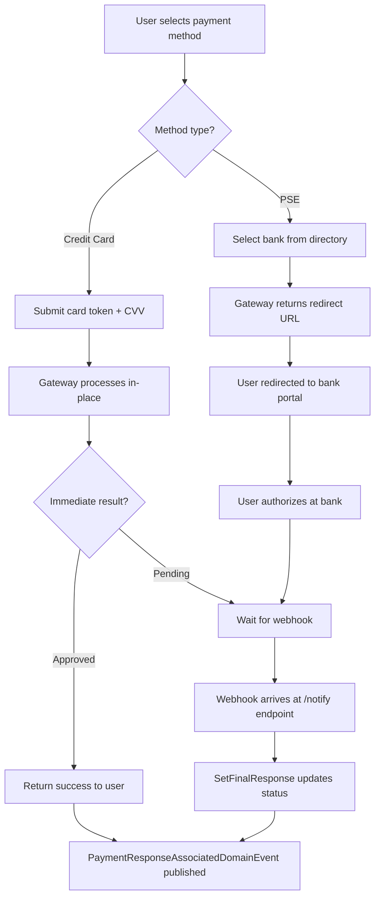

# Payments Microservice

## Overview

The Payments microservice is the platform's payment gateway abstraction layer. It receives payment initiation requests via gRPC from internal microservices, routes them to the configured external provider (PayU or MercadoPago), tracks the full transaction lifecycle, and publishes domain events when payments are confirmed or rejected. The service decouples payment processing from business logic using a Module + ReferenceId routing pattern, allowing any microservice to use the same payment infrastructure without coupling to gateway-specific details. It also maintains a catalog of supported payment methods per provider and a bank directory for PSE (bank transfer) operations.

## Business Context

In a microservices architecture, multiple bounded contexts may need to collect payments: license purchases, invoice settlements, subscription renewals, or marketplace transactions. Without a centralized payment service, each microservice would need to integrate directly with payment gateways, manage webhook security, handle idempotency, and deal with provider-specific protocols. This creates duplication, security risks, and inconsistent payment tracking.

The Payments microservice solves this by acting as the single integration point with external payment providers. Calling microservices identify themselves through the `Module` field (e.g., "Licenses", "Invoicing") and reference their own entity through `ReferenceId`. When the gateway responds (either synchronously for credit cards or asynchronously via webhook for PSE), Payments publishes the `PaymentResponseAssociatedDomainEvent` carrying the Module and ReferenceId, allowing the originating service to correlate the payment result back to its own domain entity.

For a new developer: think of Payments as the "cashier booth." Any service that needs to collect money sends the cashier the bill details. The cashier talks to the bank (PayU/MercadoPago), and when the bank responds, the cashier announces the result on a loudspeaker (RabbitMQ) so the right service picks up the confirmation.

## Ubiquitous Language

| Term | Definition |
| --- | --- |
| Payment | A single monetary transaction processed through an external gateway. Tracks the complete lifecycle from initiation through final resolution (succeeded or failed). |
| Module | A string identifier that tags a payment with its originating business context (e.g., "Licenses", "Invoicing"). Used for event routing so the correct consumer picks up the result. |
| ReferenceId | A Guid provided by the calling microservice that links the payment back to the domain entity that triggered it (e.g., an Order ID in ms-licenses). |
| PaymentProvider | The external gateway that processes the transaction: PayU or MercadoPago. Selected at payment initiation time. |
| PaymentMethod | A specific instrument within a provider: credit card, debit card, PSE bank transfer, bank reference, mobile payment, or cash. Stored as a catalog aggregate. |
| PaymentStatus | The lifecycle state of a payment: Unknown, Initiated, Succeeded, Failed, Expired, or Pending. |
| InitiateResponse | The immediate response from the gateway after initiating a transaction. For credit cards this may contain the approval result; for PSE it contains the bank redirect URL. |
| FinalResponse | The asynchronous response received via webhook from the gateway after the transaction is fully processed. Determines the terminal status (Succeeded or Failed). |
| Webhook | An HTTP callback from the payment gateway to the `/api/Payment/notify/{providerName}` endpoint, carrying the final transaction result and a signature for verification. |
| Buyer | The person purchasing the product or service. Contains full name, email, phone, and identification. |
| Payer | The person making the payment (may differ from the buyer). If not provided, defaults to the buyer's data. |
| Tokenization | The process of securely storing credit card details with the provider and receiving a reusable token for future transactions, avoiding PCI scope in the application. |
| Bank | An entity in the PSE bank directory. Users select their bank during PSE payment flow to be redirected to the correct online banking portal. |
| DateCards | Reference data for credit card expiration date validation (valid month/year combinations). |
| FinancialNetwork | A value object capturing the raw response codes from the financial network: payment network response code, error message, traceability code, authorization code, and response code. |
| TransactionId | The unique identifier assigned by the external payment provider to track the transaction on their side. |

## Domain Model

The Payments domain is organized around three aggregates. `PaymentAggregate` is the central entity tracking a single payment transaction from initiation to resolution. `PaymentMethodAggregate` represents a supported payment method within a provider (e.g., "VISA" credit card in PayU). `BanksAggregate` represents a bank available for PSE transfers. The `PaymentMethod` value object (from the shared SDK) and `FinancialNetwork` record capture payment instrument details and network responses respectively.

## Data Dictionary

### PaymentAggregate

The central aggregate tracking a single payment transaction. Created via gRPC by internal microservices. Updated when the gateway responds (immediately or via webhook).

| Field | Type | Description |
| --- | --- | --- |
| Id | Guid | Unique identifier of the payment transaction |
| Module | string | Originating business context (e.g., "Licenses", "Invoicing"). Used as routing key in events |
| ReferenceId | Guid | Identifier of the domain entity in the calling microservice (e.g., Order ID) |
| Tenant | Guid? | Identifier of the tenant context (null for pre-tenant payments like license purchase) |
| Status | PaymentStatus | Current lifecycle state: Initiated, Succeeded, Failed, Expired, Pending |
| SubTotal | Money | Payment amount before taxes (minor units + ISO 4217 currency) |
| Tax | Money | Tax amount applied to the payment |
| Total | Money | Final amount charged: SubTotal + Tax (enforced by domain guard) |
| Buyer | Buyer | Identity of the person purchasing |
| Payer | Payer | Identity of the person paying (defaults to Buyer if not provided) |
| PaymentMethod | PaymentMethod | Instrument details: type, token/card data, bank code for PSE |
| Description | string | Human-readable description of what is being paid for |
| PaymentProvider | PaymentProvider | Selected gateway: PayU or MercadoPago (None is rejected) |
| InitiateResponse | Dictionary\<string, string?\> | Immediate gateway response (redirect URL, widget params, approval status) |
| FinalResponse | Dictionary\<string, string?\> | Webhook/final gateway response (transaction result, network codes) |
| IsActive | bool | Soft-delete flag |
| CreatedBy | Guid | User who initiated the payment |
| CreatedAt | Instant | UTC timestamp of creation |
| UpdatedAt | Instant? | UTC timestamp of last status change |

### PaymentMethodAggregate

Catalog of available payment methods per provider. Seeded at startup by `PaymentMethodSeedBackgroundService`. Used by the frontend to display available payment options.

| Field | Type | Description |
| --- | --- | --- |
| Id | Guid | Unique identifier of the payment method |
| Provider | PaymentProvider | The gateway this method belongs to (PayU, MercadoPago) |
| Name | string | Display name (e.g., "VISA", "PSE", "MASTERCARD"). Max 64 chars |
| Code | string | Provider-specific code used in API calls (e.g., "VISA", "PSE"). Max 32 chars |
| Type | TypePaymentMethod | Category: CreditCard, DebitCard, BankTransfer, BankReference, MobilePaymentService, Cash |
| Comments | string? | Optional description or usage notes. Max 124 chars |
| IsActive | bool | Whether this method is currently available for selection |
| CreatedAt | Instant | UTC timestamp of creation |
| UpdatedAt | Instant? | UTC timestamp of last modification |

### BanksAggregate

Directory of banks available for PSE (bank transfer) payments. Displayed to users during PSE payment flow so they can select their bank.

| Field | Type | Description |
| --- | --- | --- |
| Id | Guid | Unique identifier of the bank |
| Name | string | Bank display name (e.g., "Bancolombia", "Davivienda") |
| Description | string | Additional description of the bank |
| Code | string | Provider-specific bank code used in PSE initiation |
| IsActive | bool | Whether the bank is currently available for PSE transfers |
| CreatedAt | Instant | UTC timestamp of creation |
| UpdatedAt | Instant? | UTC timestamp of last modification |

### Amount (Value Object)

Legacy value object for monetary amounts within the Payments domain. Amount is stored as a long in minor units (centavos). Currency follows ISO 4217 (3 uppercase letters).

| Field | Type | Description |
| --- | --- | --- |
| Value | long | Monetary amount in minor units (e.g., 15000000 = $150,000 COP) |
| Currency | string | ISO 4217 currency code (e.g., "COP", "USD") |

### FinancialNetwork (Value Object)

Captures the raw financial network response codes from the payment provider. Used for debugging, auditing, and dispute resolution.

| Field | Type | Description |
| --- | --- | --- |
| PaymentNetworkResponseCode | string | Response code from the card network (Visa, Mastercard) |
| PaymentNetworkResponseErrorMessage | string | Error message from the network if the transaction was rejected |
| TrazabilityCode | string | Traceability code for tracking the transaction in the financial network |
| AuthorizationCode | string | Authorization code issued by the issuing bank on approval |
| ResponseCode | string | Provider-level response code summarizing the transaction result |

### Enumerations Reference

**PaymentStatus:** Unknown, Initiated, Succeeded, Failed, Expired, Pending

**PaymentProvider:** None (rejected at creation), Payu, MercadoPago

**TypePaymentMethod:** None, CreditCard, DebitCard, BankReference, BankTransfer, MobilePaymentService, Cash

## Payment Lifecycle

A payment begins in `Initiated` status when created via the gRPC `InitiatePayment` call. The gateway processes the request and returns an immediate response (`SetInitiateResponse`). For credit cards, the response may already indicate approval or rejection. For PSE bank transfers, the response contains a redirect URL for the user to complete payment at their bank portal. In both cases, the gateway later sends a webhook notification with the final result. The webhook handler calls `SetFinalResponse`, which transitions the payment to its terminal state and emits the `PaymentResponseAssociatedDomainEvent`.

## Integration Architecture

The Payments microservice acts as a pure infrastructure service. It has no knowledge of business domains; it only knows that someone with a `Module` name and a `ReferenceId` wants to charge a certain amount. This design allows unlimited consumers to use the same payment infrastructure by simply providing their own Module string.

## Credit Card vs PSE Flow

The payment experience differs by method type. Credit card payments are processed in-place: the gateway validates the card, applies fraud rules, and returns an immediate approval or rejection. PSE payments require user redirection to their bank's online portal to authorize the transfer. Both converge at the webhook step for final confirmation.

## Event Catalog

### Events Produced

All events are published to RabbitMQ with the `[EventKey<PaymentAggregate>]` attribute for routing. The `PaymentResponseAssociatedDomainEvent` is the critical event that other microservices consume to learn the outcome of their payment requests.

| Event | Trigger | Payload | Purpose |
| --- | --- | --- | --- |
| `PaymentInitiatedDomainEvent` | `PaymentAggregate.Create()` | Module, SubTotal, Tax, Total, Buyer, Payer, PaymentMethod, Description, Provider, Tenant | Signals that a new payment transaction has been created. Used for audit and monitoring |
| `PaymentInitiationRespondedDomainEvent` | `SetInitiateResponse()` | Response dictionary, Tenant | Captures the gateway's immediate response (redirect URL, widget params). Used for audit |
| `PaymentResponseAssociatedDomainEvent` | `SetFinalResponse()` | Module, ReferenceId, Status, Response dictionary, Tenant | THE key event consumed by other microservices to know the payment result. Routes by Module+ReferenceId |
| `TransactionIdAssignedDomainEvent` | Transaction ID set | ProviderTransactionId | Records the external provider's transaction identifier for reconciliation |

### Events Consumed

The Payments microservice does not consume events from other microservices. All payment initiation happens through the gRPC interface, and webhook callbacks arrive via the REST endpoint. This keeps the service stateless with respect to business domain knowledge.

## API Reference

Base path: `/api`

### Payment Operations

The webhook endpoint and card tokenization. The webhook is anonymous (called by external gateways); tokenization requires authentication.

| Method | Path | Description | Auth |
| --- | --- | --- | --- |
| POST | `/api/Payment/notify/{providerName}` | Webhook receiver for payment gateway notifications. Verifies signature, updates status, emits event | Anonymous |
| POST | `/api/Payment/tokenize` | Tokenizes a credit card with the selected provider for reusable payments | Bearer |

### Payment Methods (Catalog)

Read-only catalog of available payment methods per provider. Used by frontends to display payment options to users.

| Method | Path | Description | Auth |
| --- | --- | --- | --- |
| GET | `/api/PaymentMethod/{provider}` | List payment methods for a provider, optionally filtered by type | Anonymous |

### Banks (PSE Directory)

Read-only bank directory for PSE bank transfer flow. Users select their bank before being redirected.

| Method | Path | Description | Auth |
| --- | --- | --- | --- |
| GET | `/api/Bank` | List all active banks available for PSE transfers | Anonymous |

### Date Cards

Reference data for credit card expiration validation.

| Method | Path | Description | Auth |
| --- | --- | --- | --- |
| GET | `/api/DateCards` | List valid expiration date combinations (month/year) | Anonymous |

### gRPC

The primary interface for internal microservices to initiate payments.

| Service | Method | Description | Callers |
| --- | --- | --- | --- |
| Payment | InitiatePayment | Creates a payment, processes with gateway, returns response (PaymentId + metadata) | ms-licenses, ms-invoicing, any internal service |

All REST endpoints return RFC 7807 Problem Details on error.

## Key Design Decisions

- **Module + ReferenceId pattern:** Decouples payment processing from business domain knowledge. The Payments service has zero understanding of what "Licenses" or "Invoicing" means; it simply stores the module string and echoes it back in events for correlation.

- **Adapter factory for multiple providers:** `IPaymentProviderAdapterFactory` selects the correct adapter (PayU, MercadoPago) based on the `PaymentProvider` enum. Each adapter translates the generic payment request into provider-specific API calls and normalizes the response.

- **Webhook signature verification:** Every webhook notification is validated against the provider's signature before processing. Invalid signatures result in a 403 response, preventing fraudulent status updates.

- **Payer defaults to Buyer:** If no explicit payer is provided, the system creates one from the buyer's information via `Payer.CreateFromBuyer()`. This simplifies the common case where the purchaser is also the payer.

- **Total = SubTotal + Tax invariant:** Enforced at creation time by a domain guard. Prevents accidental inconsistencies in monetary calculations.

- **Status transition guards:** `SetInitiateResponse` and `SetFinalResponse` can only be called when status is `Initiated`. `SetFinalResponse` only accepts `Succeeded` or `Failed` as terminal states. This prevents invalid state transitions.

- **All amounts in minor units (long):** Consistent with the platform-wide convention. The shared `Money` value object ensures currency-safe arithmetic.

- **gRPC for initiation, REST for webhooks:** Internal callers use gRPC for type safety and performance. External gateways use REST webhooks because that is what they support natively.

- **Seeded payment method catalog:** The `PaymentMethodSeedBackgroundService` pre-populates available payment methods (VISA, MASTERCARD, PSE, etc.) on startup, ensuring the catalog is always ready.

- **No event consumption:** Payments is a pure "fire and forget" service from the event perspective. It produces events for others but never subscribes to business domain events, keeping it maximally decoupled.

## Related Microservices

| Microservice | Direction | Integration Point |
| --- | --- | --- |
| Licenses | Inbound (gRPC) / Outbound (event) | Receives `InitiatePayment` for license purchases; publishes `PaymentResponseAssociatedDomainEvent` with Module="Licenses" |
| Invoicing | Inbound (gRPC) / Outbound (event) | Receives `InitiatePayment` for invoice settlements; publishes `PaymentResponseAssociatedDomainEvent` with Module="Invoicing" |
| Any future service | Inbound (gRPC) / Outbound (event) | Any microservice can initiate payments by providing its own Module string |
| PayU | Outbound (HTTP) / Inbound (webhook) | Processes credit card and PSE payments; sends webhook notifications to `/api/Payment/notify/Payu` |
| MercadoPago | Outbound (HTTP) / Inbound (webhook) | Alternative payment provider; sends webhook notifications to `/api/Payment/notify/MercadoPago` |
