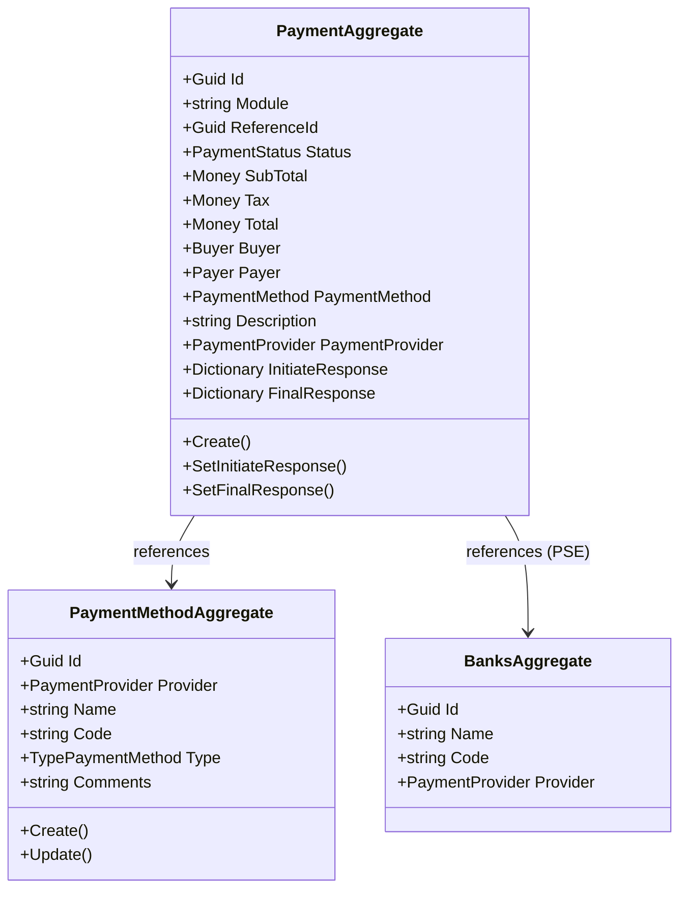
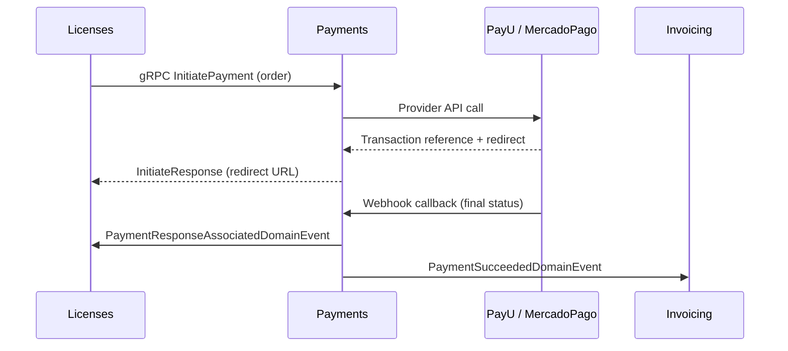

# Payments Microservice

## Overview

The Payments microservice is the platform's payment gateway abstraction layer. It receives payment initiation requests (via gRPC from other microservices), routes them to the appropriate external provider (PayU or MercadoPago), stores the transaction lifecycle, and emits events when payments succeed or fail. It supports multiple payment methods including credit cards, debit cards, PSE bank transfers, bank references, mobile payments, and cash. It also manages a catalog of available payment methods per provider and a bank directory for PSE transfers.

## Business Context

A multi-tenant platform that handles billing needs a centralized payment processing layer that abstracts away the complexity of different payment gateways, their APIs, tokenization requirements, webhook callbacks, and reconciliation flows. Without this abstraction, every microservice that needs to collect money (Licenses for subscriptions, Invoicing for property fees) would need to implement its own gateway integration.

The Payments microservice solves this by providing a single entry point for payment initiation. Calling microservices provide the amount, buyer information, and payment method; Payments handles the rest (provider selection, API calls, webhook processing, status updates). When a payment completes, it emits a domain event that the calling microservice consumes to finalize its business operation.

For a new developer: this is the "cashier window" of the platform. Other microservices tell it "charge this amount to this person using this method," and it handles the interaction with external payment gateways.

## Ubiquitous Language

| Term              | Definition                                                                                                                              |
| ----------------- | --------------------------------------------------------------------------------------------------------------------------------------- |
| Payment           | A financial transaction initiated by a platform module to collect money from a buyer. Tracks the full lifecycle from initiation to resolution. |
| PaymentProvider   | An external payment gateway service: PayU or MercadoPago. Each provider has different APIs and supported methods.                       |
| PaymentMethod     | A specific instrument for making a payment: credit card, debit card, PSE, bank reference, mobile payment, or cash.                      |
| PaymentStatus     | The lifecycle state of a payment: Initiated, Succeeded, Failed, Expired, Pending.                                                       |
| Module            | The calling context that initiated the payment (e.g., "Orders" from Licenses, "Invoicing" from billing).                                |
| ReferenceId       | The identifier of the entity in the calling module that this payment is for (e.g., the Order ID).                                        |
| Buyer             | The person making the purchase. Contains name, email, phone, and document information.                                                   |
| Payer             | The person responsible for payment (may differ from buyer). Defaults to buyer if not specified.                                           |
| Money             | A value object encapsulating a decimal amount and ISO 4217 currency code.                                                                |
| SubTotal          | The base amount before taxes.                                                                                                            |
| Tax               | The tax amount applied to the payment.                                                                                                   |
| Total             | SubTotal plus Tax. The full amount charged to the payer. Domain guard ensures Total equals SubTotal + Tax.                               |
| InitiateResponse  | The immediate response from the provider after initiating a transaction (redirect URL, widget data, or transaction reference).            |
| FinalResponse     | The asynchronous response from the provider (via webhook) confirming the final payment status.                                           |
| Webhook           | The callback endpoint that payment providers call to notify the platform of transaction status changes.                                   |
| Tokenization      | The process of securely storing payment card details as a token with the provider, avoiding PCI compliance burden on the platform.        |
| PSE               | "Pagos Seguros en Linea" - Colombia's real-time bank transfer system. Requires bank selection from the BanksAggregate catalog.           |
| BanksAggregate    | A catalog of banks available for PSE transfers, organized by provider.                                                                    |
| TypePaymentMethod | Classification of payment methods: CreditCard, DebitCard, BankReference, BankTransfer, MobilePaymentService, Cash.                       |

## Domain Model

The Payments domain has three aggregates. The `PaymentAggregate` is the central entity tracking a payment transaction lifecycle. The `PaymentMethodAggregate` catalogs available payment instruments per provider. The `BanksAggregate` holds the PSE bank directory.

## Data Dictionary

### PaymentAggregate

The central aggregate representing a payment transaction.

| Field            | Type                         | Description                                                          |
| ---------------- | ---------------------------- | -------------------------------------------------------------------- |
| Id               | Guid                         | Unique identifier of the payment                                     |
| Module           | string                       | Calling context name (e.g., "Orders", "Invoicing")                   |
| ReferenceId      | Guid                         | ID of the entity in the calling module                               |
| Tenant           | Guid?                        | Tenant that owns the payment (null for platform-level payments)      |
| Status           | PaymentStatus                | Current lifecycle state                                              |
| SubTotal         | Money                        | Base amount before taxes                                             |
| Tax              | Money                        | Tax amount                                                           |
| Total            | Money                        | Full charged amount (must equal SubTotal + Tax)                      |
| Buyer            | Buyer                        | Person making the purchase                                           |
| Payer            | Payer                        | Person responsible for payment                                       |
| PaymentMethod    | PaymentMethod                | Selected payment instrument                                          |
| Description      | string                       | Human-readable payment description                                   |
| PaymentProvider  | PaymentProvider              | Selected gateway (PayU or MercadoPago)                               |
| InitiateResponse | Dictionary\<string,string?\> | Provider's immediate response data                                   |
| FinalResponse    | Dictionary\<string,string?\> | Provider's webhook response data                                     |
| CreatedBy        | Guid                         | User who initiated the payment                                       |
| CreatedAt        | Instant                      | UTC timestamp of creation                                            |

### Enumerations Reference

**PaymentProvider:** None, Payu, MercadoPago

**PaymentStatus:** Unknown, Initiated, Succeeded, Failed, Expired, Pending

**TypePaymentMethod:** None, CreditCard, DebitCard, BankReference, BankTransfer, MobilePaymentService, Cash

## Integration Architecture

Payments receives initiation requests via gRPC from other microservices and communicates with external providers. It emits events consumed by the calling microservice to complete their business flows.

## Event Catalog

### Events Produced

| Event                                    | Trigger                  | Consumers       | Purpose                                        |
| ---------------------------------------- | ------------------------ | --------------- | ---------------------------------------------- |
| `PaymentInitiatedDomainEvent`            | `Create()`               | Internal/Audit  | Payment transaction created                    |
| `PaymentInitiationRespondedDomainEvent`  | `SetInitiateResponse()`  | Internal        | Provider responded to initiation               |
| `PaymentResponseAssociatedDomainEvent`   | `SetFinalResponse()`     | Calling module  | Final payment status resolved (success/failure)|

## API Reference

Base path: `/api`

### Payments

| Method | Path                       | Description                                      | Auth    |
| ------ | -------------------------- | ------------------------------------------------ | ------- |
| GET    | `/api/Payment`             | Paginated list of payments (supports Criteria)   | Bearer  |
| GET    | `/api/Payment/{id}`        | Get a payment by ID                              | Bearer  |
| POST   | `/api/Payment`             | Initiate a new payment                           | Bearer  |
| POST   | `/api/Payment/webhook`     | Provider webhook callback endpoint               | None    |

### Payment Methods

| Method | Path                       | Description                                      | Auth    |
| ------ | -------------------------- | ------------------------------------------------ | ------- |
| GET    | `/api/PaymentMethod`       | List available payment methods                   | Bearer  |
| GET    | `/api/PaymentMethod/{id}`  | Get a payment method by ID                       | Bearer  |

### Banks (PSE)

| Method | Path              | Description                            | Auth    |
| ------ | ----------------- | -------------------------------------- | ------- |
| GET    | `/api/Banks`      | List banks available for PSE transfers | Bearer  |

### gRPC Services

| Service        | Method          | Description                                    |
| -------------- | --------------- | ---------------------------------------------- |
| PaymentService | InitiatePayment | Creates a payment and returns provider response|

All REST endpoints return RFC 7807 Problem Details on error.

## Key Design Decisions

- **Provider abstraction:** The microservice abstracts PayU and MercadoPago behind a common interface, allowing new providers to be added without changing calling microservices.

- **Total validation guard:** The domain enforces that `Total == SubTotal + Tax` at creation, preventing accounting discrepancies.

- **Status can only advance:** `SetFinalResponse` only accepts Succeeded or Failed as final status, and only when current status is Initiated, preventing invalid state transitions.

- **Payer defaults to buyer:** If no payer is explicitly provided, the system creates one from the buyer's information, simplifying the common case where they are the same person.

- **Response dictionaries:** InitiateResponse and FinalResponse use flexible dictionaries because each provider returns different data structures. This avoids tightly coupling to any provider's schema.

- **Webhook endpoint is anonymous:** The provider callback endpoint does not require authentication since external gateways cannot provide JWT tokens. Validation is done via provider-specific signatures.

## Related Microservices

| Microservice | Direction     | Integration Point                                                        |
| ------------ | ------------- | ------------------------------------------------------------------------ |
| Licenses     | Inbound       | Initiates payments for license purchases via gRPC                        |
| Invoicing    | Inbound       | Receives payment success events for document reconciliation              |
| PayU         | External      | Payment gateway for Colombia (credit cards, PSE, cash references)        |
| MercadoPago  | External      | Payment gateway for Latin America (cards, bank transfers, wallets)        |
